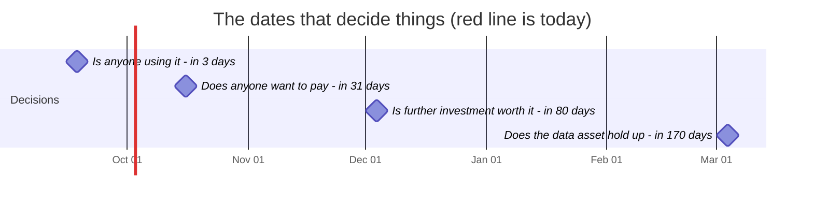
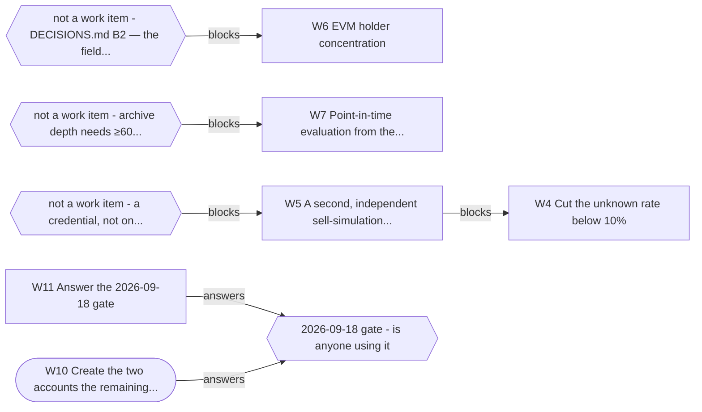

# What you need to know (OWNER.md)

> **Generated. Do not edit this file** -- run `python tools/owner.py --write`.
> Every date, number and task below is read out of the file that owns it, so this
> page cannot quietly drift out of date. `tests/test_owner_page.py` fails the
> build if it does.
>
> Generated 2026-09-15.

## The project in one paragraph

VetAgent is a safety check an AI agent calls before it buys a crypto token. It is
live at `https://vetagent.dev`, free, and anyone can use it without signing up.
It is not sold, it has no users we can name, and the only question that matters
right now is whether anyone outside this project actually uses it. Everything
below is organised around that question and the date it gets answered.

## Needs you, soonest first

These are the things I cannot do. Everything else in this project is mine.

| When | Due | # | What you do | Blocked? |
|---|---|---|---|---|
| **in 3 days** | 2026-09-18 | W10 | Create the two accounts the remaining directories need | no |
| **in 3 days** | 2026-09-18 | W11 | Answer the 2026-09-18 gate | no |
| **in 3 days** | 2026-09-18 | -- | Post Experiment C | no |
| in 31 days | 2026-10-16 | W5 | A second, independent sell-simulation source | **yes -- see below** |
| in 31 days | 2026-10-16 | W12 | Decide the price-history trade-off | no |
| in 31 days | 2026-10-16 | W29 | Get three free market-data API keys, so a two-hour probe can settle whether a key ends the | no |

### W10 Create the two accounts the remaining directories need

- **When:** 2026-09-18 (**in 3 days**)
- **Why then:** distribution is the whole of the gate's failing branch
- **You know it is done when:** `CHANNELS` in `bench/scorecard.py`, updated only by someone who went and looked
- **If you do nothing:** Nothing. Six submissions are already queued and the two parked ones are one signup away; waiting costs reach, not work.

### W11 Answer the 2026-09-18 gate

- **When:** 2026-09-18 (**in 3 days**)
- **Why then:** this IS the gate -- it has to be answered on the day
- **You know it is done when:** `python bench/usage.py`, counting rule already fixed in code; then a `Resolved:` line in `STRATEGY.md` §8, which `test_gates_get_reviewed.py` requires once due
- **If you do nothing:** A gate that passes its date in silence teaches everyone that gates are decoration, and this is the first one that can stop the project.

###  Post Experiment C

- **When:** 2026-09-18 (**in 3 days**)
- **Why then:** The gate's failing branch prescribes exactly this, so it happens either way. Drafts are written and every number in them is checked by the build: docs/EXPERIMENT_C.md. Nothing is posted without you -- it is your name on it.
- **You know it is done when:** a post exists on at least one of HN, r/ethdev, X or the MCP Discord
- **If you do nothing:** This is the one action that can change the 09-18 answer. Not doing it does not delay the gate -- the gate still fires, and it fires on no.

### W5 A second, independent sell-simulation source

- **When:** 2026-10-16 (in 31 days)
- **Why then:** needed for W3, which every accuracy claim rests on
- **You know it is done when:** **Blocked** on a credential, not on engineering. Probed 2026-09-06: staysafu unreachable (SSL), quickintel 401, tokensniffer 401, de.fi public endpoint 404. Every candidate needs a paid key — this is a W9-shaped item that belongs to whoever holds the budget
- **If you do nothing:** Every accuracy claim keeps resting on a single sell simulator. If it is wrong, we cannot tell, and neither can anyone reading the benchmark.

### W12 Decide the price-history trade-off

- **When:** 2026-10-16 (in 31 days)
- **Why then:** changes what the benchmark can measure, so before the D gate
- **You know it is done when:** A decision recorded in `DECISIONS.md`, either way
- **If you do nothing:** The 10-16 gate arrives with the measurement question still open, so that gate answers a smaller question than it was meant to.

### W29 Get three free market-data API keys, so a two-hour probe can settle whether a key ends the `unknown` answers

- **When:** 2026-10-16 (in 31 days)
- **Why then:** the first decision that spends money, so settle it before the gate that asks whether anyone will pay
- **You know it is done when:** Decision rule fixed before running: over 12 rounds in 2 hours from a throwaway Worker, **pass** if in rounds where the keyless control drew a 429 the keyed calls drew none and at most 1% non-2xx; **inconclusive** if the control never drew a 429 (re-run when production fails); **fail** for a provider answering 429/403/1020 under its documented limit. Pay only if a provider passes and projected volume exceeds its free allowance; the smallest paid step is CoinGecko Basic at $35 for one month. **Ran 2026-09-14 14:00-15:52 UTC, 12 rounds, all four providers PASS.** Keys set by the owner as secrets on a throwaway Worker (vetagent-keyprobe, not in this repo). In all 12 rounds a keyless control drew a 429: GeckoTerminal 48 of 60 calls, DexPaprika 38 x 429 and 22 x 402 (its per-IP monthly allowance already spent by the shared egress). In the same rounds from the same Worker, keyed calls: CoinGecko 60/60 HTTP 200, DexPaprika 60/60 plus 60/60 pool details, Codex 60/60 -- zero 429s, zero non-2xx. Field check passed on every chain in every round for all four; the only misses were DAI's top pool on CoinGecko (no seller count) and DexPaprika detail (reserves), 3 rounds each. Median latency: Codex 186 ms, CoinGecko 401 ms, DexPaprika 844 ms. **What this does not show:** every round ran from one data centre (KIX) and one egress IP, and keyless DexScreener answered 200 on all 60 calls here although production logged `dexscreener 429` the same day -- so it settles that a key escapes the throttling, not which colos production is throttled in. Two drained tokens were used instead of three, stated in the probe before it ran. **Next, owner's call:** which provider VetAgent adopts, and whether its free-tier terms (CoinGecko Demo: attribution required; Codex: 'personal & hobby') allow a public free service. **Owner, 2026-09-15: terms are fine, integrate.** Codex was then rejected on its data, not its terms: real response bodies captured by the probe Worker show its pool listing ranking testnet pools and int64-max liquidity first for WETH, and on mainnet a "USDT pool" holding 30,250,000,000 USDT -- fed to the depth check (E21) that would reopen the fabricated-depth hole (`bench/production/codex-samples-2026-09-15.json`). CoinGecko, the same data VetAgent already falls back to, is integrated instead (D8): DexScreener, then CoinGecko with the key, then keyless GeckoTerminal, and the contested-honeypot seller count goes through the key too. The probe Worker and its KV namespace are deleted. **Left for the owner:** set `CG_DEMO_KEY` on the vetagent Worker -- until then the code runs keyless, exactly as before. Verify: `bench/production/verdicts.json`'s unknown share falls in the days after the secret is set, from 40.7% on 2026-09-14
- **If you do nothing:** The keyed fallback is deployed and does nothing until the secret exists: 40.7% of production answers were `unknown` over the week to 2026-09-14, and the callers Experiment C brings in meet that rate first. Setting it is one command.

## The dates that decide things

A gate is a question with a rule, written down before the date so it cannot be
argued with afterwards. On the day, the rule is read and it decides what happens
next -- including stopping.

| Date | When | The question | What happens |
|---|---|---|---|
| 2026-09-18 | **in 3 days** | Is anyone using it | Yes → continue; no → run only Experiment C, add no features |
| 2026-10-16 | in 31 days | Does anyone want to pay | Yes → build payments; no → pick a different customer segment and run D again |
| 2026-12-04 | in 80 days | Is further investment worth it | Yes → continue per §7; no → move to low-maintenance mode |
| 2027-03-04 | in 170 days | Does the data asset hold up | Yes → that becomes the main product; no → keep the tool, drop the data narrative |

## The same thing as a picture

If a diagram below disagrees with a table above, the diagram is the bug -- both
are generated from the same files, so they cannot disagree without a defect.



### Is the archive still collecting?

```text
·········████████████   2026-08-25 -> 2026-09-14
```

`█` a day collected &nbsp; `○` **a day missing, permanently** &nbsp; `·` before collection started.

**12 days, no gaps.** Newest is 2026-09-14, yesterday.

The collector is scheduled four times a day and GitHub runs it late every time -- typically four to five hours -- so the newest mark being yesterday is normal and a hole is not.

### Why something is stuck



Rounded = parked by you. Hexagons are not work items -- they are what a row is waiting on from outside this backlog. **7 other open items have no chain and are not drawn**, which is the honest reason the picture is small: most of the backlog is not blocked, it is just not done.

## Where it stands today

| | |
|---|---|
| Maturity score | 50 / 100 (`docs/SCORECARD.md`) |
| Tokens measured | 576 |
| False positives | 4.3% -- we called a healthy token dangerous |
| Answers we refuse | 18.2% -- `unknown`, on purpose |
| Dead tokens we rated high | 10.0% -- our worst number, published first |
| Round in progress | R22: Owner decisions, and a score that can see an attack |

The score's ceiling for engineering alone is about 70. The missing points are
distribution and users, which is why more building cannot move it.

## What I am doing right now

**R22 -- Owner decisions, and a score that can see an attack**

The owner accepted the open recommendations: stale data caps confidence, the parked ideas keep their review dates, the positioning sentence goes into STRATEGY, and a keyed market-data source gets priced. The maturity score had no line that could see any of R21, so it is being widened -- in both directions.

## What changed in the last 7 days

Every line is one commit, newest first. The full message says what the
problem looked like before it was fixed.

- W29: the key probe passed -- all four keyed providers, 12 rounds, zero 429s
- First production reading: guards 5/5, production unknown 40.7% -- and stop copying the score
- Regenerate the owner page after rebasing onto the latest snapshots
- Positioning sentence into STRATEGY, and the market-data key probe onto the owner's list
- The maturity score could not see R21, so it now can -- and it went down, 55 -> 44
- The owner page said R19 was in progress, and its corrections stopped at 09-09
- Regenerate the scorecard: E22 added a test and its evidence cell counts them
- O7-O11: the owner accepted the review dates; O8's prerequisite has shipped

_89 more not shown (97 commits in total)._

## What I got wrong

I am the one measuring my own work, so this section is the part of the page that
costs me something. A build check requires an entry here every 14 days: if there
were genuinely no mistakes, saying so is itself a dated claim on the record.

Newest first.

**2026-09-14** &mdash; I said: *'Rate limiting is live: 60 calls a minute per caller.'*

> It never limited anything. From one IP, 313 calls in 100 seconds were all served. Cloudflare's rate-limit binding answered 'allowed' every time; it was replaced by a counter in the edge cache, which trips at about 64.

> How it surfaced: Caught by the deploy check written in the same commit, which floods production and requires a 429. I had shipped the limiter before watching it limit.

**2026-09-14** &mdash; I said: *'Of the 146 tokens with $10k or more of depth, 0 were rated high' -- in the launch post, after the benchmark had moved.*

> One was: TRAC, held by the wash-trading guard. The number guard checked the 146 and not the 0, and 'All 7 false positives are among the thin ones' was false the same way.

> How it surfaced: Caught by reading the post line by line after the guard reported green.

**2026-09-14** &mdash; I said: *The first fix for the wash-trading hole: keep the honeypot verdict fatal whenever distinct sellers cannot be counted.*

> It condemned real tokens for our own outage: 12 healthy tokens went medium to high. Read live, CVX had 18 distinct sellers, THQ 28, AKE 789 -- genuine simulator false positives, including AKE, which the audit had presented as the hole. Uncountable now means unknown, not high.

> How it surfaced: Caught by the benchmark run on the fix, then one live read of both sources.

**2026-09-14** &mdash; I said: *'GoPlus shipped agentguard three days ago -- a same-category move.' (relayed from the audit)*

> agentguard guards AI agents against malicious skills and leaked secrets -- its own description at github.com/GoPlusSecurity/agentguard says so. It is not a token-risk tool.

> How it surfaced: Caught by one `gh api` call while checking figures for the strategy paragraph.

**2026-09-12** &mdash; I said: *'The owner-power scan catches 62.5% of the powers that exist, and 89.5% of mutable taxes' -- published for three days, and said to callers by the product.*

> Both were in-sample: scored on the contracts the selector list was mined from. On a contract it has not seen it finds 50.0%, and 31.6% of mutable taxes.

> How it surfaced: Caught by the R20 external audit. My own guard passed, because the file it checked held the wrong number too.

**2026-09-09** &mdash; I said: *'mcpservers.org emailed to say we are live, and the listing is not on the site.'*

> It is live, at mcpservers.org/en/servers/vetagent-dev, findable by searching their homepage. Their slug comes from the domain (`vetagent-dev`), I guessed it from the product name, got a 404, and reported an absence. The page I treated as the index of every remote server is a curated subset.

> How it surfaced: You caught it. I had checked four places, found nothing, and said 'not on the site' instead of 'not where I looked' -- in a session spent fixing that exact error in five other places.

**2026-09-08** &mdash; I said: *'Nobody outside the project is calling it' was answered YES by the usage gate.*

> Both callers were us: `mozilla` was the demo button on our own homepage and `curl` was our own deploy pipeline, because until 09-07 the telemetry could not tell them apart from a stranger. The corrected reading is **no**.

> How it surfaced: Caught by re-reading the instrument after fixing it, not by the instrument.

**2026-09-08** &mdash; I said: *`find_new_hot_pools` told callers it had found 20 pools.*

> It returned three. `count` was counting what it fetched, not what it sent.

> How it surfaced: Caught by calling the tool while writing an app-store submission. 263 tests had passed over it.

**2026-09-08** &mdash; I said: *'The daily archive will reach about 1 GB of git history within a year.'*

> The whole repository is 4.10 MiB. I had measured the temporary local copy instead of what the server actually stores -- off by roughly 18x, and a storage ticket was filed on it.

> How it surfaced: Caught by one command, `git gc`, run a day too late.

**2026-09-07** &mdash; I said: *'83% of the benchmark data is one chain, which is a real weakness.'*

> 58%. The 83% was a 47-token subset, quoted for a set twelve times larger. The weakness is real and smaller than I said.

> How it surfaced: Caught by making the number computable instead of typed.

**2026-09-07** &mdash; I said: *'The sell simulator has not indexed these tokens yet.'*

> It had. I was sending `base_0x1234...` -- GeckoTerminal's pool id, with the chain name glued to the front -- where honeypot.is wanted the bare `0x1234...` address. 6 empty answers looked exactly like 'not indexed', because a wrong question and an unindexed token return the same nothing.

> How it surfaced: Caught by printing what was actually sent.

The pattern worth noticing: **most of these made things look worse than they
were, not better.** Being wrong in the pessimistic direction is still being wrong,
and it is the direction that quietly kills good work.

## How to check on me without reading any code

```bash
python tools/owner.py --write   # regenerate this page
```

- **Is it alive?** Open <https://vetagent.dev> and press a demo button.
- **Is anyone using it?** GitHub -> Actions -> "Usage -- who is actually
  calling" -> Run workflow. The last line of the gate section is the answer.
- **Are the published numbers true?** GitHub -> Actions. If the build is green,
  every accuracy number on the site and in the docs matches the last benchmark
  run. That check is the reason a number cannot go stale without failing.
- **What changed lately?** `docs/ROUNDS.md`, generated from the commits.

## The words I keep using

**A gate** -- A date with a question and a rule, written down BEFORE the date. On the day, the rule is read and it decides what happens next. The point is that the rule cannot be argued with afterwards. This project has four.

**`unknown`** -- A verdict that means 'a check I needed could not run'. It is not 'low risk' and it is not a bug -- it is the product refusing to guess. 18.2% of answers are this.

**Fail-closed** -- When something breaks, answer 'I don't know' rather than 'looks fine'. A safety tool that guesses optimistically when it is broken is worse than no tool.

**False positive** -- We said a token was dangerous and it was fine. Ours is 4.3%. This is the number that costs a user money by making them skip a good trade.

**Recall** -- Of the bad things that existed, how many did we catch. Ours on tokens that actually died is 10%. It is the worst number we publish, and we publish it first.

**The oracle** -- The independent judge the benchmark scores us against. Ours is GoPlus, and it is deliberately NOT wired into the product -- if the thing being tested could read the answer key, the test would mean nothing. A test in the build enforces that.

**Held-out** -- Kept away from the thing being measured, on purpose. Same idea as above.

**MCP** -- The plug that lets an AI assistant call an outside tool. This project is an MCP server, so an assistant can ask it about a token before buying.

**W-numbers (W9, W11...)** -- Work items in docs/BACKLOG.md. They keep their number forever, including when the answer was 'we tried this and it failed'.

**R-numbers (R16, R17...)** -- Rounds of work in docs/ROUNDS.md, generated from the commit history.

**The usage gate / telemetry** -- A count of who calls the server. It records no addresses, no identities and no token names -- which is why it cannot simply tell you who a caller is.

**Experiment C** -- Posting the benchmark publicly and seeing whether anyone bites. It is the project's distribution test, not a marketing exercise.

---

If something here is unclear, that is a defect in this page, not in your
understanding. Say which line and it gets rewritten.
