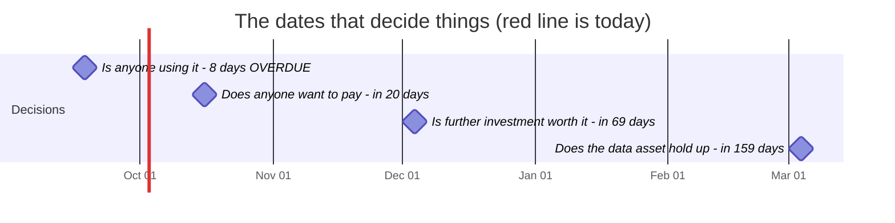
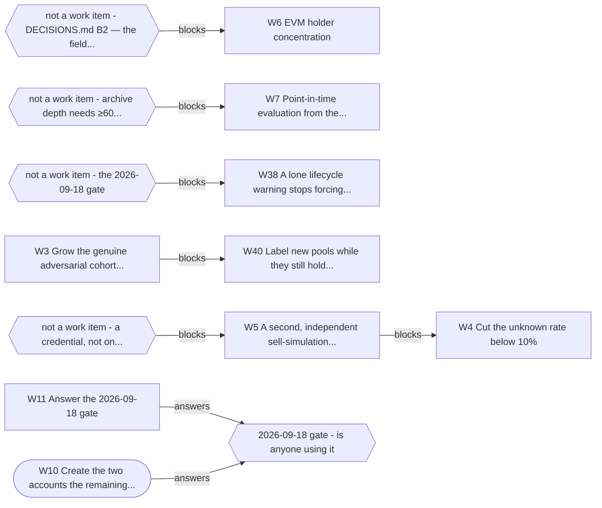

# What you need to know (OWNER.md)

> **Generated. Do not edit this file** -- run `python tools/owner.py --write`.
> Every date, number and task below is read out of the file that owns it, so this
> page cannot quietly drift out of date. `tests/test_owner_page.py` fails the
> build if it does.
>
> Generated 2026-09-26.

## The project in one paragraph

VetAgent is a safety check an AI agent calls before it buys a crypto token. It is
live at `https://vetagent.dev`, free, and anyone can use it without signing up.
It is not sold, it has no users we can name, and the only question that matters
right now is whether anyone outside this project actually uses it. Everything
below is organised around that question and the date it gets answered.

## Needs you, soonest first

These are the things I cannot do. Everything else in this project is mine.

| When | Due | # | What you do | Blocked? |
|---|---|---|---|---|
| **8 days OVERDUE** | 2026-09-18 | W10 | Create the two accounts the remaining directories need | no |
| **8 days OVERDUE** | 2026-09-18 | W11 | Answer the 2026-09-18 gate | no |
| in 20 days | 2026-10-16 | W5 | A second, independent sell-simulation source | **yes -- see below** |
| in 20 days | 2026-10-16 | W12 | Decide the price-history trade-off | no |

### W10 Create the two accounts the remaining directories need

- **When:** 2026-09-18 (**8 days OVERDUE**)
- **Why then:** distribution is the whole of the gate's failing branch
- **You know it is done when:** `CHANNELS` in `bench/scorecard.py`, updated only by someone who went and looked
- **If you do nothing:** Nothing. Six submissions are already queued and the two parked ones are one signup away; waiting costs reach, not work.

### W11 Answer the 2026-09-18 gate

- **When:** 2026-09-18 (**8 days OVERDUE**)
- **Why then:** this IS the gate -- it has to be answered on the day
- **You know it is done when:** `python bench/usage.py`, counting rule already fixed in code; then a `Resolved:` line in `STRATEGY.md` §8, which `test_gates_get_reviewed.py` requires once due
- **If you do nothing:** A gate that passes its date in silence teaches everyone that gates are decoration, and this is the first one that can stop the project.

### W5 A second, independent sell-simulation source

- **When:** 2026-10-16 (in 20 days)
- **Why then:** needed for W3, which every accuracy claim rests on
- **You know it is done when:** **Blocked** on a credential, not on engineering. Probed 2026-09-06: staysafu unreachable (SSL), quickintel 401, tokensniffer 401, de.fi public endpoint 404. Every candidate needed a paid key (**2026-09-15, from its pricing page:** Quick Intel now lists a free API Testing tier, 200 calls a month on approval, and a keyless pay-per-scan endpoint at $0.03 paid in USDC; whether its scan simulates a sell is not yet known; next owner step: apply for the testing tier) — this is a W9-shaped item that belongs to whoever holds the budget
- **If you do nothing:** Every accuracy claim keeps resting on a single sell simulator. If it is wrong, we cannot tell, and neither can anyone reading the benchmark.

### W12 Decide the price-history trade-off

- **When:** 2026-10-16 (in 20 days)
- **Why then:** changes what the benchmark can measure, so before the D gate
- **You know it is done when:** A decision recorded in `DECISIONS.md`, either way
- **If you do nothing:** The 10-16 gate arrives with the measurement question still open, so that gate answers a smaller question than it was meant to.

## The dates that decide things

A gate is a question with a rule, written down before the date so it cannot be
argued with afterwards. On the day, the rule is read and it decides what happens
next -- including stopping.

| Date | When | The question | What happens |
|---|---|---|---|
| 2026-09-18 | **8 days OVERDUE** | Is anyone using it | Yes → continue; no → run only Experiment C, add no features. **Resolved:** `gate_verdict()` printed YES (usage.yml run 35374258574, 2026-09-18 17:25 UTC) on `curl` (14 calls over 4 days, JP on 14 of 14 rows: our own untagged probes from this machine's Tokyo egress, 63c485b; adding JP to OWNER_COUNTRIES turns it NEAR and does not change the verdict) and `mozilla` (23 calls over 9 days; its verdicts come from GET /assess, and the bucket is any `Mozilla/` user agent, crawlers included). Recorded as the frozen rule printed it, and read for what it is: **not evidence of adoption** -- no identified stranger received a verdict, and 3,169 of 3,259 attributable tool calls (97.2%) were ours -> continue per §7: Experiment C now; Experiment D (20 operators, the $99/month line, each with its own client tag) sent by 2026-09-23; E only when a D reply asks how to pay; no new features before 10-16 (fixes are not features). |
| 2026-10-16 | in 20 days | Does anyone want to pay | Yes → build payments; no → pick a different customer segment and run D again |
| 2026-12-04 | in 69 days | Is further investment worth it | Yes → continue per §7; no → move to low-maintenance mode |
| 2027-03-04 | in 159 days | Does the data asset hold up | Yes → that becomes the main product; no → keep the tool, drop the data narrative |

## The same thing as a picture

If a diagram below disagrees with a table above, the diagram is the bug -- both
are generated from the same files, so they cannot disagree without a defect.



### Is the archive still collecting?

```text
█████████████████████   2026-09-06 -> 2026-09-26
```

`█` a day collected &nbsp; `○` **a day missing, permanently** &nbsp; `·` before collection started.

**24 days, no gaps.** Newest is 2026-09-26, today.

The collector is scheduled four times a day and GitHub runs it late every time -- typically four to five hours -- so the newest mark being yesterday is normal and a hole is not.

### Why something is stuck



Rounded = parked by you. Hexagons are not work items -- they are what a row is waiting on from outside this backlog. **17 other open items have no chain and are not drawn**, which is the honest reason the picture is small: most of the backlog is not blocked, it is just not done.

## Where it stands today

| | |
|---|---|
| Maturity score | 44 / 100 (`docs/SCORECARD.md`) |
| Tokens measured | 576 |
| False positives | 3.1% -- we called a healthy token dangerous |
| Answers we refuse | 21.2% -- `unknown`, on purpose |
| Dead tokens we rated high | 10.0% -- our worst number, published first |
| Round in progress | R23: A numbers audit, checked before it was believed |

The score's ceiling for engineering alone is about 70. The missing points are
distribution and users, which is why more building cannot move it.

## What I am doing right now

**R23 -- A numbers audit, checked before it was believed**

An audit traced the false blocks and the unknowns to honeypot.is and proposed releasing its flags. Nine verifiers replayed it on the cache: the counts mostly held and the reading did not -- the flag is real holders failing to sell -- and the replay found a defect it missed. Defects and false public sentences are fixed first, before the Experiment C post; rule changes wait for the 09-18 gate.

## What changed in the last 7 days

Every line is one commit, newest first. The full message says what the
problem looked like before it was fixed.

- E14 review of W58: a fallback's 404 is an answer, and two tests guard their gate again
- W59: the benchmark replays cached answers against today's clock
- Production records why a high was high, as it already did for an unknown
- An empty DexScreener listing the fallback never confirmed is not an absence (W58)
- A signal that weighs nothing is never named as what decided the verdict (W56)
- Both bots regenerate what their data moves, after it, and test.yml runs after them (E34)
- The live unknown rate is published with its own n and window, not a stale one
- Our coverage gap and the signal that says so are filed as one act

_29 more not shown (37 commits in total)._

## What I got wrong

I am the one measuring my own work, so this section is the part of the page that
costs me something. A build check requires an entry here every 14 days: if there
were genuinely no mistakes, saying so is itself a dated claim on the record.

Newest first.

**2026-09-19** &mdash; I said: *The Experiment C post as it went live on dev.to (2026-09-19): 'the engine as of 2026-09-18', and a re-run paragraph with no false-block figure.*

> The figures came from commit 4d86202 (2026-09-19 15:13 UTC), the rule that took false blocks to 20. And the reviewer's cold re-run had put false blocks at 36 of 149, outside the 25 to 35 tolerance registered while it ran, whose rule says such a miss is printed in the post. The post printed '60 of the 576 verdicts moved' and not that. Both are fixed on dev.to and in docs/EXPERIMENT_C.md, the post says the sentence came late, and the registration is now public in bench/drift/2026-09-17/.

> How it surfaced: Caught by the two-lens check of the X, r/ethdev and Discord texts, which read the registration. I had checked the post's numbers against the benchmark and never its promises against the registration that made them.

**2026-09-18** &mdash; I said: *'USDT and WBTC themselves are rated low (4 of 4 benchmark rows)' -- written in W30 (2026-09-15) as the correction to a false USDT claim, and put on five surfaces, three of them live pages.*

> The USDT/Ethereum row it counted was a PulseChain copy of USDT priced at $0.00095: DexScreener's capped answer held 30 PulseChain pairs and no Ethereum pool, and the live default call answered medium. The guard counted rows by ticker, so it could not see it. Fixed in the engine (the token's own chain is read before a copy can be judged) and the guard now matches the contracts' addresses; the post says so.

> How it surfaced: Caught by the 2026-09-18 pre-post review, which read the row's pool, not its verdict. I had checked that the four rows said low, not what they said low about.

**2026-09-15** &mdash; I said: *'W41 run 1 committed and pushed' -- reported with the tests workflow red on both W41 commits (c66aba1 and b74e72e).*

> docs/SELL_SIMULATION.md carries percentages and was in neither list the number guard reads, so tests/test_number_coverage.py failed in CI. Before each of those commits I ran a hand-picked subset of the tests instead of the full loop, and did not read CI afterwards.

> How it surfaced: Caught by the full loop before the W43 commit -- and the fix itself went red in CI, dated 2026-09-16 by a local clock eight hours ahead of the build's UTC one. It is the 2026-09-09 failure again -- checked one place, reported green -- and the fix is the same: the full loop before every commit, and every workflow read after every push.

**2026-09-15** &mdash; I said: *'honeypot.is flagged a token while its own simulation passed and thousands of sells went through: a simulator false positive' -- the reading behind the contested-honeypot rule, its signal text and its test fixture.*

> The flag comes from honeypot.is's holder test: in 53 of 54 benchmark cases, real holders' sells failed while a fresh address could trade. That is what a blacklist honeypot looks like. The rule's outcome (medium, never low) was still right; the sentence given to callers, and the fixture with 0 of 1,555 holders failed, were not.

> How it surfaced: Caught while checking the 2026-09-15 numbers audit, which proposed releasing the flag on the same misreading. I had never opened the part of the answer I was explaining.

**2026-09-15** &mdash; I said: *'Adopt Codex as the fallback: it is the only provider with both reserve amounts and distinct sellers in one query, and the fastest.'*

> Its data is not safe to use. Real response bodies showed its pool listing ranking testnet pools and int64-max liquidity first for WETH, and a mainnet 'USDT pool' reporting 30,250,000,000 USDT -- fed to the depth check, that reopens the fabricated-depth hole. CoinGecko was integrated instead (bench/production/codex-samples-2026-09-15.json).

> How it surfaced: Caught before any code used it, by capturing real responses to write the tests against. I had recommended it from its field list and a 60/60 status count, not from its data.

**2026-09-14** &mdash; I said: *'Rate limiting is live: 60 calls a minute per caller.'*

> It never limited anything. From one IP, 313 calls in 100 seconds were all served. Cloudflare's rate-limit binding answered 'allowed' every time; it was replaced by a counter in the edge cache, which trips at about 64.

> How it surfaced: Caught by the deploy check written in the same commit, which floods production and requires a 429. I had shipped the limiter before watching it limit.

**2026-09-14** &mdash; I said: *'Of the 146 tokens with $10k or more of depth, 0 were rated high' -- in the launch post, after the benchmark had moved.*

> One was: TRAC, held by the wash-trading guard. The number guard checked the 146 and not the 0, and 'All 7 false positives are among the thin ones' was false the same way.

> How it surfaced: Caught by reading the post line by line after the guard reported green.

**2026-09-14** &mdash; I said: *The first fix for the wash-trading hole: keep the honeypot verdict fatal whenever distinct sellers cannot be counted.*

> It condemned real tokens for our own outage: 12 healthy tokens went medium to high. Read live, CVX had 18 distinct sellers, THQ 28, AKE 789 -- genuine simulator false positives, including AKE, which the audit had presented as the hole. Uncountable now means unknown, not high.

> How it surfaced: Caught by the benchmark run on the fix, then one live read of both sources.

**2026-09-14** &mdash; I said: *'GoPlus shipped agentguard three days ago -- a same-category move.' (relayed from the audit)*

> agentguard guards AI agents against malicious skills and leaked secrets -- its own description at github.com/GoPlusSecurity/agentguard says so. It is not a token-risk tool.

> How it surfaced: Caught by one `gh api` call while checking figures for the strategy paragraph.

**2026-09-12** &mdash; I said: *'The owner-power scan catches 62.5% of the powers that exist, and 89.5% of mutable taxes' -- published for three days, and said to callers by the product.*

> Both were in-sample: scored on the contracts the selector list was mined from. On a contract it has not seen it finds 50.0%, and 31.6% of mutable taxes.

> How it surfaced: Caught by the R20 external audit. My own guard passed, because the file it checked held the wrong number too.

**2026-09-09** &mdash; I said: *'mcpservers.org emailed to say we are live, and the listing is not on the site.'*

> It is live, at mcpservers.org/en/servers/vetagent-dev, findable by searching their homepage. Their slug comes from the domain (`vetagent-dev`), I guessed it from the product name, got a 404, and reported an absence. The page I treated as the index of every remote server is a curated subset.

> How it surfaced: You caught it. I had checked four places, found nothing, and said 'not on the site' instead of 'not where I looked' -- in a session spent fixing that exact error in five other places.

**2026-09-08** &mdash; I said: *'Nobody outside the project is calling it' was answered YES by the usage gate.*

> Both callers were us: `mozilla` was the demo button on our own homepage and `curl` was our own deploy pipeline, because until 09-07 the telemetry could not tell them apart from a stranger. The corrected reading is **no**.

> How it surfaced: Caught by re-reading the instrument after fixing it, not by the instrument.

**2026-09-08** &mdash; I said: *`find_new_hot_pools` told callers it had found 20 pools.*

> It returned three. `count` was counting what it fetched, not what it sent.

> How it surfaced: Caught by calling the tool while writing an app-store submission. 263 tests had passed over it.

**2026-09-08** &mdash; I said: *'The daily archive will reach about 1 GB of git history within a year.'*

> The whole repository is 4.10 MiB. I had measured the temporary local copy instead of what the server actually stores -- off by roughly 18x, and a storage ticket was filed on it.

> How it surfaced: Caught by one command, `git gc`, run a day too late.

**2026-09-07** &mdash; I said: *'83% of the benchmark data is one chain, which is a real weakness.'*

> 58%. The 83% was a 47-token subset, quoted for a set twelve times larger. The weakness is real and smaller than I said.

> How it surfaced: Caught by making the number computable instead of typed.

**2026-09-07** &mdash; I said: *'The sell simulator has not indexed these tokens yet.'*

> It had. I was sending `base_0x1234...` -- GeckoTerminal's pool id, with the chain name glued to the front -- where honeypot.is wanted the bare `0x1234...` address. 6 empty answers looked exactly like 'not indexed', because a wrong question and an unindexed token return the same nothing.

> How it surfaced: Caught by printing what was actually sent.

The pattern worth noticing: **most of these made things look worse than they
were, not better.** Being wrong in the pessimistic direction is still being wrong,
and it is the direction that quietly kills good work.

## How to check on me without reading any code

```bash
python tools/owner.py --write   # regenerate this page
```

- **Is it alive?** Open <https://vetagent.dev> and press a demo button.
- **Is anyone using it?** GitHub -> Actions -> "Usage -- who is actually
  calling" -> Run workflow. The last line of the gate section is the answer.
- **Are the published numbers true?** GitHub -> Actions. If the build is green,
  every accuracy number on the site and in the docs matches the last benchmark
  run. That check is the reason a number cannot go stale without failing.
- **What changed lately?** `docs/ROUNDS.md`, generated from the commits.

## The words I keep using

**A gate** -- A date with a question and a rule, written down BEFORE the date. On the day, the rule is read and it decides what happens next. The point is that the rule cannot be argued with afterwards. This project has four.

**`unknown`** -- A verdict that means 'a check I needed could not run'. It is not 'low risk' and it is not a bug -- it is the product refusing to guess. 21.2% of answers are this.

**Fail-closed** -- When something breaks, answer 'I don't know' rather than 'looks fine'. A safety tool that guesses optimistically when it is broken is worse than no tool.

**False positive** -- We said a token was dangerous and it was fine. Ours is 3.1%. This is the number that costs a user money by making them skip a good trade.

**Recall** -- Of the bad things that existed, how many did we catch. Ours on tokens that actually died is 10%. It is the worst number we publish, and we publish it first.

**The oracle** -- The independent judge the benchmark scores us against. Ours is GoPlus, and it is deliberately NOT wired into the product -- if the thing being tested could read the answer key, the test would mean nothing. A test in the build enforces that.

**Held-out** -- Kept away from the thing being measured, on purpose. Same idea as above.

**MCP** -- The plug that lets an AI assistant call an outside tool. This project is an MCP server, so an assistant can ask it about a token before buying.

**W-numbers (W9, W11...)** -- Work items in docs/BACKLOG.md. They keep their number forever, including when the answer was 'we tried this and it failed'.

**R-numbers (R16, R17...)** -- Rounds of work in docs/ROUNDS.md, generated from the commit history.

**The usage gate / telemetry** -- A count of who calls the server. It records no addresses, no identities and no token names -- which is why it cannot simply tell you who a caller is.

**Experiment C** -- Posting the benchmark publicly and seeing whether anyone bites. It is the project's distribution test, not a marketing exercise.

---

If something here is unclear, that is a defect in this page, not in your
understanding. Say which line and it gets rewritten.
