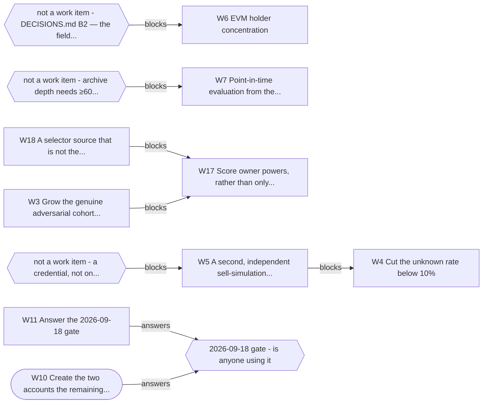

# What you need to know (OWNER.md)

> **Generated. Do not edit this file** -- run `python tools/owner.py --write`.
> Every date, number and task below is read out of the file that owns it, so this
> page cannot quietly drift out of date. `tests/test_owner_page.py` fails the
> build if it does.
>
> Generated 2026-09-09.

## The project in one paragraph

VetAgent is a safety check an AI agent calls before it buys a crypto token. It is
live at `https://vetagent.dev`, free, and anyone can use it without signing up.
It is not sold, it has no users we can name, and the only question that matters
right now is whether anyone outside this project actually uses it. Everything
below is organised around that question and the date it gets answered.

## Needs you, soonest first

These are the things I cannot do. Everything else in this project is mine.

| When | Due | # | What you do | Blocked? |
|---|---|---|---|---|
| **in 9 days** | 2026-09-18 | W10 | Create the two accounts the remaining directories need | no |
| **in 9 days** | 2026-09-18 | W11 | Answer the 2026-09-18 gate | no |
| **in 9 days** | 2026-09-18 | -- | Post Experiment C | no |
| in 37 days | 2026-10-16 | W5 | A second, independent sell-simulation source | **yes -- see below** |
| in 37 days | 2026-10-16 | W12 | Decide the price-history trade-off | no |

### W10 Create the two accounts the remaining directories need

- **When:** 2026-09-18 (**in 9 days**)
- **Why then:** distribution is the whole of the gate's failing branch
- **You know it is done when:** `CHANNELS` in `bench/scorecard.py`, updated only by someone who went and looked
- **If you do nothing:** Nothing. Six submissions are already queued and the two parked ones are one signup away; waiting costs reach, not work.

### W11 Answer the 2026-09-18 gate

- **When:** 2026-09-18 (**in 9 days**)
- **Why then:** this IS the gate -- it has to be answered on the day
- **You know it is done when:** `python bench/usage.py`, counting rule already fixed in code; then a `Resolved:` line in `STRATEGY.md` §8, which `test_gates_get_reviewed.py` requires once due
- **If you do nothing:** A gate that passes its date in silence teaches everyone that gates are decoration, and this is the first one that can stop the project.

###  Post Experiment C

- **When:** 2026-09-18 (**in 9 days**)
- **Why then:** The gate's failing branch prescribes exactly this, so it happens either way. Drafts are written and every number in them is checked by the build: docs/EXPERIMENT_C.md. Nothing is posted without you -- it is your name on it.
- **You know it is done when:** a post exists on at least one of HN, r/ethdev, X or the MCP Discord
- **If you do nothing:** This is the one action that can change the 09-18 answer. Not doing it does not delay the gate -- the gate still fires, and it fires on no.

### W5 A second, independent sell-simulation source

- **When:** 2026-10-16 (in 37 days)
- **Why then:** needed for W3, which every accuracy claim rests on
- **You know it is done when:** **Blocked** on a credential, not on engineering. Probed 2026-09-06: staysafu unreachable (SSL), quickintel 401, tokensniffer 401, de.fi public endpoint 404. Every candidate needs a paid key — this is a W9-shaped item that belongs to whoever holds the budget
- **If you do nothing:** Every accuracy claim keeps resting on a single sell simulator. If it is wrong, we cannot tell, and neither can anyone reading the benchmark.

### W12 Decide the price-history trade-off

- **When:** 2026-10-16 (in 37 days)
- **Why then:** changes what the benchmark can measure, so before the D gate
- **You know it is done when:** A decision recorded in `DECISIONS.md`, either way
- **If you do nothing:** The 10-16 gate arrives with the measurement question still open, so that gate answers a smaller question than it was meant to.

## The dates that decide things

A gate is a question with a rule, written down before the date so it cannot be
argued with afterwards. On the day, the rule is read and it decides what happens
next -- including stopping.

| Date | When | The question | What happens |
|---|---|---|---|
| 2026-09-18 | **in 9 days** | Is anyone using it | Yes → continue; no → run only Experiment C, add no features |
| 2026-10-16 | in 37 days | Does anyone want to pay | Yes → build payments; no → pick a different customer segment and run D again |
| 2026-12-04 | in 86 days | Is further investment worth it | Yes → continue per §7; no → move to low-maintenance mode |
| 2027-03-04 | in 176 days | Does the data asset hold up | Yes → that becomes the main product; no → keep the tool, drop the data narrative |

## The same thing as a picture

If a diagram below disagrees with a table above, the diagram is the bug -- both
are generated from the same files, so they cannot disagree without a defect.


### Is the archive still collecting?

```text
···············██████   2026-08-19 -> 2026-09-08
```

`█` a day collected &nbsp; `○` **a day missing, permanently** &nbsp; `·` before collection started.

**6 days, no gaps.** Newest is 2026-09-08, yesterday.

The collector is scheduled four times a day and GitHub runs it late every time -- typically four to five hours -- so the newest mark being yesterday is normal and a hole is not.

### Why something is stuck



Rounded = parked by you. Hexagons are not work items -- they are what a row is waiting on from outside this backlog. **9 other open items have no chain and are not drawn**, which is the honest reason the picture is small: most of the backlog is not blocked, it is just not done.

## Where it stands today

| | |
|---|---|
| Maturity score | 55 / 100 (`docs/SCORECARD.md`) |
| Tokens measured | 576 |
| False positives | 4.3% -- we called a healthy token dangerous |
| Answers we refuse | 15.3% -- `unknown`, on purpose |
| Dead tokens we rated high | 10.0% -- our worst number, published first |
| Round in progress | R19: Point it outward, and correct what would be found |

The score's ceiling for engineering alone is about 70. The missing points are
distribution and users, which is why more building cannot move it.

## What I am doing right now

**R19 -- Point it outward, and correct what would be found**

The gate's failing branch says distribution, so the server was pointed at the places an agent might find it -- and everything it was pointed at turned out to need correcting first. The landing page carried a claim a commenter disproves in one minute, in three surfaces. The README asserted a directory grade as a frozen string. `find_new_hot_pools` answered `count: 20` beside three pools. There was no way to reach a person and no terms page. And the gate itself said YES on `mozilla` and `curl` -- our own homepage demo and our own deploy pipeline -- because thirteen of its fourteen days were written before the attribution fix; floored to rows the fixed instrument wrote, it reads no. Glama and Smithery went live, six more submissions are queued, and two were parked at a signup. The owner page gained the sections that let someone who cannot read the code decide whether to believe it.

## What changed in the last 7 days

Every line is one commit, newest first. The full message says what the
problem looked like before it was fixed.

- I got the adversarial cohort wrong, then pointed a guard at the error
- The live /llms.txt carried three stale counts the guard never covered
- Two FATAL findings from the hostile review of the launch post
- The test I added yesterday turned the build red on eight commits
- An HTML view of the owner's page, generated from the same one file
- Two generated diagrams on the owner page, and not a diagramming pipeline
- "The only part of this product that cannot be copied" — we publish it, 4x a day
- Blockaid's false-positive rate was wrong by 10x on the live homepage

_174 more not shown (182 commits in total)._

## What I got wrong

I am the one measuring my own work, so this section is the part of the page that
costs me something. A build check requires an entry here every 14 days: if there
were genuinely no mistakes, saying so is itself a dated claim on the record.

Newest first.

**2026-09-09** &mdash; I said: *'mcpservers.org emailed to say we are live, and the listing is not on the site.'*

> It is live, at mcpservers.org/en/servers/vetagent-dev, findable by searching their homepage. Their slug comes from the domain (`vetagent-dev`), I guessed it from the product name, got a 404, and reported an absence. The page I treated as the index of every remote server is a curated subset.

> How it surfaced: You caught it. I had checked four places, found nothing, and said 'not on the site' instead of 'not where I looked' -- in a session spent fixing that exact error in five other places.

**2026-09-08** &mdash; I said: *'Nobody outside the project is calling it' was answered YES by the usage gate.*

> Both callers were us: `mozilla` was the demo button on our own homepage and `curl` was our own deploy pipeline, because until 09-07 the telemetry could not tell them apart from a stranger. The corrected reading is **no**.

> How it surfaced: Caught by re-reading the instrument after fixing it, not by the instrument.

**2026-09-08** &mdash; I said: *`find_new_hot_pools` told callers it had found 20 pools.*

> It returned three. `count` was counting what it fetched, not what it sent.

> How it surfaced: Caught by calling the tool while writing an app-store submission. 263 tests had passed over it.

**2026-09-08** &mdash; I said: *'The daily archive will reach about 1 GB of git history within a year.'*

> The whole repository is 4.10 MiB. I had measured the temporary local copy instead of what the server actually stores -- off by roughly 18x, and a storage ticket was filed on it.

> How it surfaced: Caught by one command, `git gc`, run a day too late.

**2026-09-07** &mdash; I said: *'83% of the benchmark data is one chain, which is a real weakness.'*

> 58%. The 83% was a 47-token subset, quoted for a set twelve times larger. The weakness is real and smaller than I said.

> How it surfaced: Caught by making the number computable instead of typed.

**2026-09-07** &mdash; I said: *'The sell simulator has not indexed these tokens yet.'*

> It had. I was sending it an identifier with the chain name glued to the front instead of an address, and six empty answers looked exactly like 'not indexed'.

> How it surfaced: Caught by printing what was actually sent.

The pattern worth noticing: **most of these made things look worse than they
were, not better.** Being wrong in the pessimistic direction is still being wrong,
and it is the direction that quietly kills good work.

## How to check on me without reading any code

```bash
python tools/owner.py --write   # regenerate this page
```

- **Is it alive?** Open <https://vetagent.dev> and press a demo button.
- **Is anyone using it?** GitHub -> Actions -> "Usage -- who is actually
  calling" -> Run workflow. The last line of the gate section is the answer.
- **Are the published numbers true?** GitHub -> Actions. If the build is green,
  every accuracy number on the site and in the docs matches the last benchmark
  run. That check is the reason a number cannot go stale without failing.
- **What changed lately?** `docs/ROUNDS.md`, generated from the commits.

## The words I keep using

**A gate** -- A date with a question and a rule, written down BEFORE the date. On the day, the rule is read and it decides what happens next. The point is that the rule cannot be argued with afterwards. This project has four.

**`unknown`** -- A verdict that means 'a check I needed could not run'. It is not 'low risk' and it is not a bug -- it is the product refusing to guess. 15.3% of answers are this.

**Fail-closed** -- When something breaks, answer 'I don't know' rather than 'looks fine'. A safety tool that guesses optimistically when it is broken is worse than no tool.

**False positive** -- We said a token was dangerous and it was fine. Ours is 4.3%. This is the number that costs a user money by making them skip a good trade.

**Recall** -- Of the bad things that existed, how many did we catch. Ours on tokens that actually died is 10%. It is the worst number we publish, and we publish it first.

**The oracle** -- The independent judge the benchmark scores us against. Ours is GoPlus, and it is deliberately NOT wired into the product -- if the thing being tested could read the answer key, the test would mean nothing. A test in the build enforces that.

**Held-out** -- Kept away from the thing being measured, on purpose. Same idea as above.

**MCP** -- The plug that lets an AI assistant call an outside tool. This project is an MCP server, so an assistant can ask it about a token before buying.

**W-numbers (W9, W11...)** -- Work items in docs/BACKLOG.md. They keep their number forever, including when the answer was 'we tried this and it failed'.

**R-numbers (R16, R17...)** -- Rounds of work in docs/ROUNDS.md, generated from the commit history.

**The usage gate / telemetry** -- A count of who calls the server. It records no addresses, no identities and no token names -- which is why it cannot simply tell you who a caller is.

**Experiment C** -- Posting the benchmark publicly and seeing whether anyone bites. It is the project's distribution test, not a marketing exercise.

---

If something here is unclear, that is a defect in this page, not in your
understanding. Say which line and it gets rewritten.
